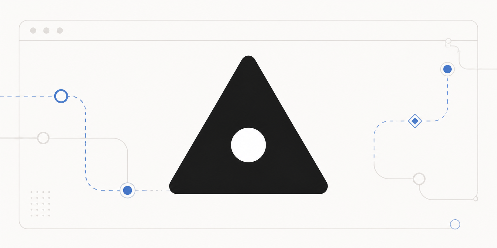

<div align="center">
  
</div>

# Safari Browser Use

Safari Browser Use lets Codex, Claude Code, GitHub Copilot, and Cursor control
your existing Safari 26 tabs with agent-written JavaScript.

It provides:

- A persistent synchronous JavaScript REPL
- A Playwright-style API for inspecting and interacting with pages
- Native plugin manifests for Codex, Claude Code, GitHub Copilot, and Cursor
- Browser automation through the Apple Events support built into macOS

It does not require Node.js, npm, a companion app, Xcode, or an Apple
Developer certificate.

## Requirements

- macOS with Safari 26
- JavaScript from Apple Events enabled in Safari

Safari 27 is not supported by this release.

## Installation

### Setup prompt

Paste into Codex, Claude Code, GitHub Copilot CLI, or Cursor:

```text
Install or upgrade Safari Browser Use for this client from https://github.com/vibevibe-labs/safari-browser-use using its native plugin system; do not install Node.js or build from source. Reload plugins when supported, or tell me to start a new session, then connect it to Safari 26. Ask me to enable "Allow JavaScript from Apple Events" if needed. Follow https://github.com/vibevibe-labs/safari-browser-use/blob/main/plugins/safari-browser-use/README.md#manual-installation if setup or connection fails.
```

### Manual installation

Follow the
[client-specific installation guide](plugins/safari-browser-use/README.md#manual-installation)
for Codex, Claude Code, GitHub Copilot CLI, or Cursor.

## Quick Start

Start with a natural-language request:

> Use Safari Browser Use to inspect my current Safari tab and summarize the page. Do not click or type anything.

Or call the `js` MCP tool directly:

```json
{
  "title": "Check Safari",
  "code": "browser.doctor()"
}
```

```json
{
  "title": "Inspect the current tab",
  "code": "var tab = browser.tabs.selected(); tab.playwright.domSnapshot()"
}
```

```json
{
  "title": "Click Continue",
  "code": "var button = tab.playwright.getByRole('button', { name: 'Continue', exact: true }); if (button.count() !== 1) throw new Error('Expected one Continue button'); button.click()"
}
```

Variables persist between `js` calls. Use `js_reset` when you want a clean
REPL context.

## Available Browser API

```js
browser.doctor()
browser.tabs.list()
var tab = browser.tabs.selected()
tab.title()
tab.url()
tab.goto("https://example.com")
tab.playwright.domSnapshot()
tab.playwright.getByLabel("Email").fill("user@example.com")
tab.playwright.getByRole("button", { name: "Submit" }).click()
```

Safari asks for Automation permission the first time the plugin controls it.
Only approve that request when you intend to let the current client automate
Safari.
