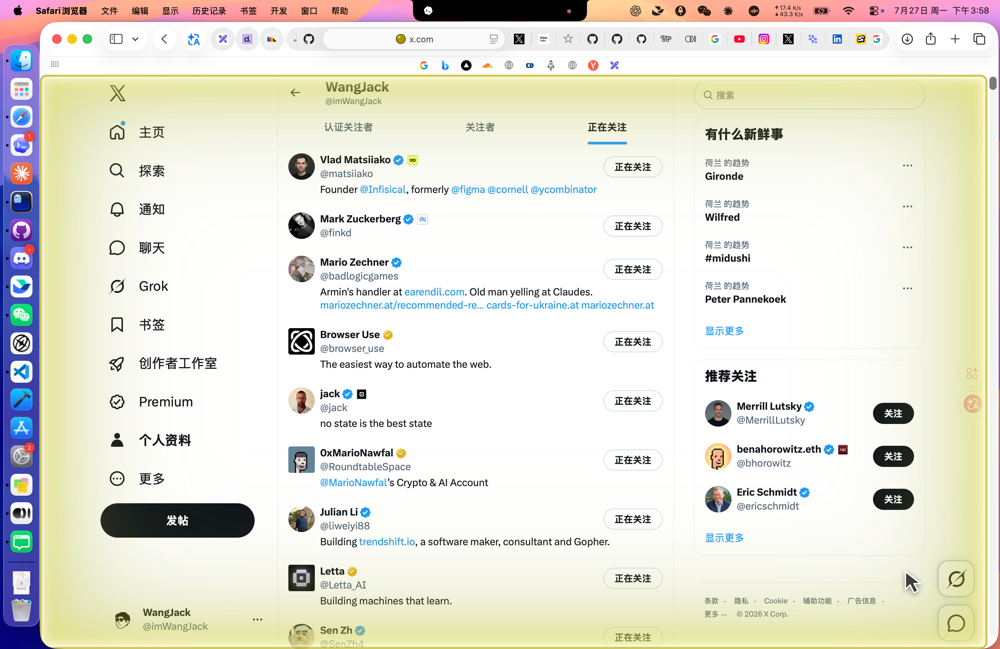
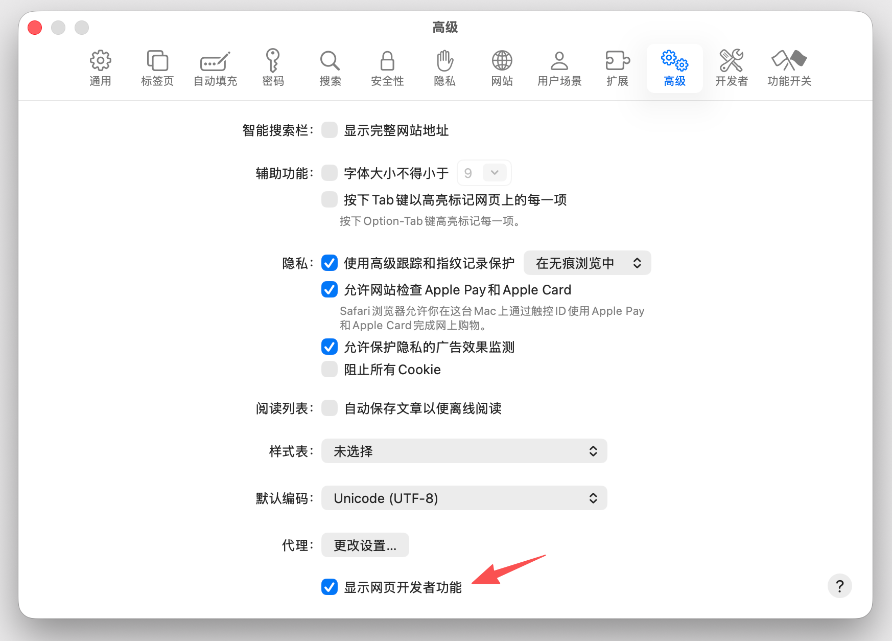
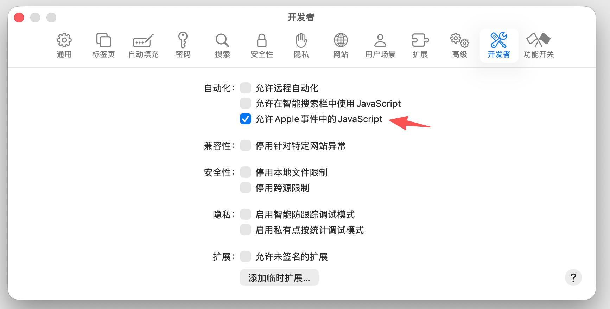

<div align="center">


**Control your existing Safari 26 tabs with AI agents — no browser extension or companion app required.**

[](https://github.com/vibevibe-labs/safari-browser-use)
[](https://www.apple.com/macos/)
[](https://www.apple.com/safari/)
[](LICENSE)
[](https://github.com/vibevibe-labs/safari-browser-use/stargazers)
[](https://github.com/vibevibe-labs)
</div>

## Overview

Safari Browser Use gives **Codex, Claude Code, GitHub Copilot, and Cursor**
safe, visible control of the Safari tabs you already have open. It preserves
your current sessions and logins while exposing a synchronous JavaScript REPL
and a Playwright-style browser API.

It connects through the Apple Events support built into macOS. It does not require Node.js,
npm, a Safari extension, a companion app, Xcode, or an Apple Developer
certificate.

## Demo

<p align="center">
  
</p>

<p align="center"><em>An AI agent inspecting an existing Safari tab with the visible control indicator enabled.</em></p>

## Installation

### Setup prompt

Paste this prompt into Codex, Claude Code, GitHub Copilot CLI, or Cursor:

```text
Install the Safari Browser Use plugin from https://github.com/vibevibe-labs/safari-browser-use using the current client's plugin installer. Stop after installation, then tell me whether to reload plugins or start a new session and give me one example request.
```

### Install manually

<details>
<summary><strong>Codex</strong></summary>

```sh
codex plugin marketplace add vibevibe-labs/safari-browser-use
codex plugin add safari-browser-use@vibevibe-labs
```

Start a new Codex task after installation.

</details>

<details>
<summary><strong>Claude Code</strong></summary>

```sh
claude plugin marketplace add vibevibe-labs/safari-browser-use --scope user
claude plugin install safari-browser-use@vibevibe-labs --scope user
```

Run `/reload-plugins` after installation.

</details>

<details>
<summary><strong>GitHub Copilot CLI</strong></summary>

```sh
copilot plugin install vibevibe-labs/safari-browser-use:plugins/safari-browser-use
```

Start a new Copilot CLI session after installation.

</details>

<details>
<summary><strong>Cursor</strong></summary>

Until the plugin is available in Cursor Marketplace, install it from a local
checkout:

```sh
git clone --depth 1 https://github.com/vibevibe-labs/safari-browser-use.git
mkdir -p "$HOME/.cursor/plugins/local"
cp -R safari-browser-use/plugins/safari-browser-use "$HOME/.cursor/plugins/local/"
```

Restart Cursor after installation.

</details>

## First-Time Setup

Before using browser automation, enable JavaScript from Apple Events in Safari.
Safari Browser Use cannot inspect or interact with web pages while this setting
is disabled.

1. Open **Safari Settings → Advanced**, then enable
   **Show features for web developers**.

<p align="center">
  
</p>

2. Open **Safari Settings → Developer → Automation**, then enable
   **Allow JavaScript from Apple Events**.

<p align="center">
  
</p>

Safari also asks for macOS Automation permission the first time the plugin
controls it. Approve that request only when you intend to let the current
client automate Safari.

## Quick Start

Open Safari, then ask your agent:

> Use Safari Browser Use to inspect my current Safari tab and summarize the
> page. Do not click or type anything.

The agent checks the connection, selects the active tab, and reads a structured
DOM snapshot. Variables persist between `js` calls; use `js_reset` when you
want a clean REPL context.

Selecting or operating a tab adds a non-interactive perimeter glow and visible
fake cursor to the controlled page. They share one control lifecycle: both are
removed with `browser.release()` when the task ends and clear automatically
after 45 seconds without tab activity.

## Highlights

| Feature | What it provides |
| --- | --- |
| 🌐 Existing Safari session | Work with your open tabs, cookies, and signed-in state |
| ⚡ Persistent synchronous REPL | Reuse variables and browser state across tool calls |
| 🎭 Playwright-style API | Locate elements by role, label, text, test ID, or attribute |
| ✨ Visible control indicator | See a perimeter glow and fake cursor while AI control is active |
| 🔌 Native agent plugins | Install directly in Codex, Claude Code, GitHub Copilot, or Cursor |
| 🛡️ Deliberate interactions | Inspect first, target unique elements, and verify every action |

## Safety

Safari Browser Use can inspect and interact with pages through your existing
browser session. Consequential actions—such as sending a message, submitting a
form, making a purchase, changing account settings, or deleting data—require
clear user authorization.

The control glow makes active automation visible, while `browser.release()`,
REPL reset, server shutdown, and the inactivity lease ensure that control does
not remain attached indefinitely.

## Support

Found a bug or have an idea? Open an
[issue](https://github.com/vibevibe-labs/safari-browser-use/issues) or explore
more projects from [VibeVibe Labs](https://github.com/vibevibe-labs).

<div align="center">

**Built for humans who want AI agents to work with the browser they already use.**

</div>

## License

Safari Browser Use is available under the [MIT License](LICENSE).

## Star History

<div align="center">

<a href="https://www.star-history.com/#vibevibe-labs/safari-browser-use&Date">
  <picture>
    <source media="(prefers-color-scheme: dark)" srcset="https://api.star-history.com/svg?repos=vibevibe-labs/safari-browser-use&type=Date&theme=dark" />
    <source media="(prefers-color-scheme: light)" srcset="https://api.star-history.com/svg?repos=vibevibe-labs/safari-browser-use&type=Date" />
    
  </picture>
</a>

</div>
